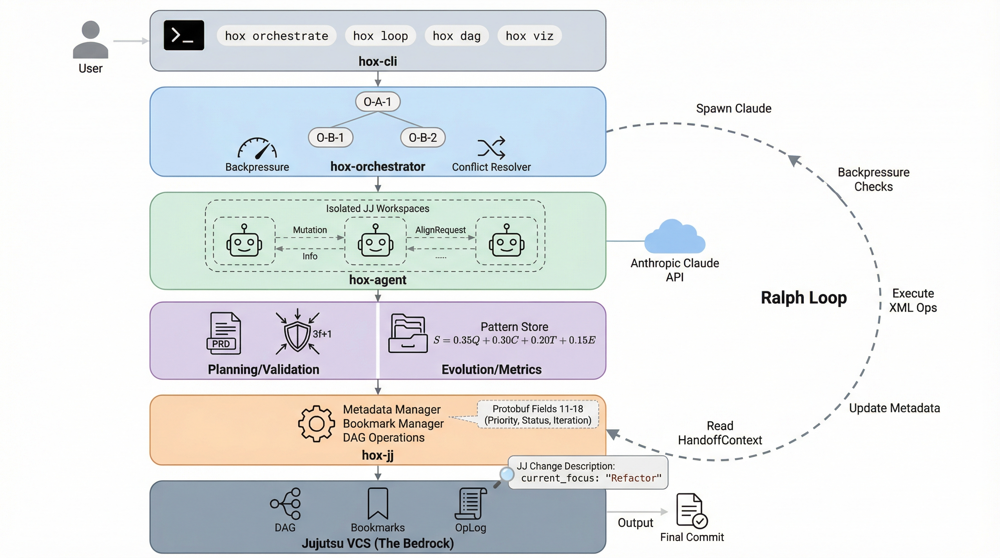
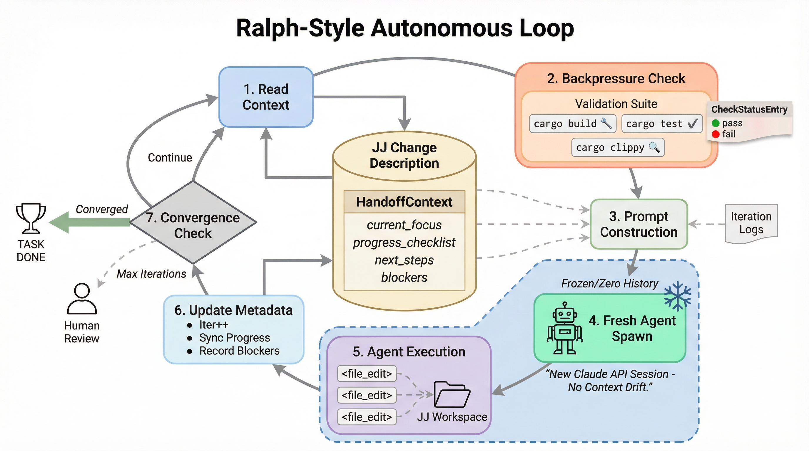
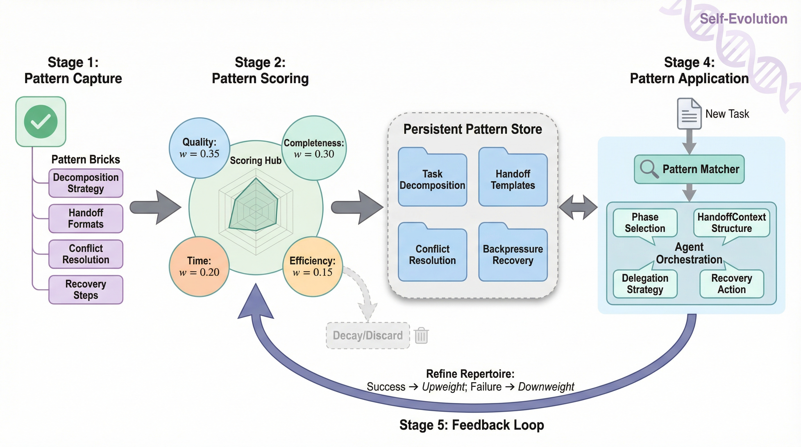

# Hox

**Your VCS is the orchestration layer.**

Named after [Hox genes](https://en.wikipedia.org/wiki/Hox_gene) — the master regulators behind the Cambrian explosion — Hox is a multi-agent orchestration system built on [jj](https://martinvonz.github.io/jj/). It turns your version control graph into a live task board where AI agents coordinate through changes, bookmarks, and DAG topology instead of databases or message queues.

```
Tasks       = jj changes         (change IDs are the primary key)
Dependencies = DAG ancestry       (parent-child = blocked-by)
Assignments  = bookmarks          (agent-42/task-xyz)
State        = change descriptions (structured metadata + handoff context)
```

The VCS is the source of truth. Everything else is a read cache.



## Why

Long-running AI agents drift. They hallucinate context, lose track of what they've done, and degrade over time. Hox solves this with two ideas:

1. **Fresh agents per iteration.** The Ralph Loop spawns a brand-new agent on every cycle. No conversation history to rot. State is persisted in jj change descriptions and fed back as structured context.

2. **Self-correcting backpressure.** Each iteration runs your build, lint, and test suite. Failures feed directly into the next agent's prompt. The loop keeps iterating until checks pass or the budget runs out.

The result: autonomous agents that stay grounded in reality because the compiler and test suite are always in the loop.

## Quick Start

```bash
cargo install --path crates/hox-cli

# Initialize in a jj repo
hox init

# Run an autonomous loop on a task
hox loop start <change-id> --max-iterations 20 --model sonnet

# Watch it work
hox dashboard        # Terminal UI
hox viz              # 3D graph in browser
```

## The Ralph Loop



The core execution engine. Each iteration:

```
┌─ Read context from jj change description (HandoffContext)
│
├─ Run backpressure checks (build, lint, test — auto-detected per language)
│
├─ Build prompt: task + context + errors from last iteration
│
├─ Spawn fresh agent (zero conversation history)
│
├─ Execute file operations, update jj change
│
└─ Loop until: checks pass │ agent signals completion │ max iterations
```

Backpressure checks are config-driven and auto-detected for Rust, Python, Node.js, Go, and Makefile/justfile projects. Breaking failures go into the prompt. The agent fixes them or the loop keeps going.

```bash
hox loop start kpqvqwzl --max-iterations 10 --model sonnet
hox loop status kpqvqwzl
hox loop stop kpqvqwzl

# Single iteration for external orchestrators (bash-friendly, JSON I/O)
hox loop external kpqvqwzl --state-file state.json --output-state next.json
```

## Multi-Agent Orchestration

For larger projects, Hox decomposes PRDs into phased plans and distributes work across agents:

```bash
# Generate a plan from a PRD
hox init --prd
hox init --from-prd requirements.md

# Orchestrate with multiple agents
hox orchestrate "Build authentication system" --orchestrators 2 --max-agents 4

# Enable hierarchical delegation (orchestrators spawn sub-orchestrators)
hox orchestrate plan.md --delegate
```

Each agent gets an isolated jj workspace. No merge conflicts between concurrent agents — jj handles that natively.

### Agent Communication

| Message Type | Direction | Semantics |
|---|---|---|
| **Mutation** | Orchestrator → Agent | Structural decisions agents MUST follow |
| **Info** | Any → Any | Status updates agents MAY read |
| **AlignRequest** | Agent → Orchestrator | "I need guidance on X" |

### Hierarchical Delegation

Orchestrators can spawn child orchestrators, each managing a subset of phases. Strategies: `PhasePerChild`, `ComplexityBased`, or `None`.

## DAG Manipulation

Hox exposes jj's DAG operations as first-class task management primitives:

```bash
hox dag parallelize <revset>           # Sequential → parallel siblings
hox dag split <change-id> <files...>   # Split a task by file group
hox dag squash <change-id>             # Merge task into parent
hox dag duplicate <change-id>          # Speculative execution branch
hox dag absorb                         # Auto-distribute changes to ancestors
hox dag backout <change-id>            # Safe revert (no history rewriting)
hox dag evolog <change-id>             # Full evolution audit trail
```

## Observability

### Terminal Dashboard (`hox dashboard`)

Ratatui-based TUI showing agent progress, phase pipeline, JJ oplog, and global metrics in real time.

```
┌──────────────────────────────────────────────────────────┐
│  ORCHESTRATION PROGRESS                                  │
│   Phase 0 ──▶ Phase 1 (Parallel) ──▶ Phase 2            │
│   [████]     [▓▓░░] [▓▓▓░] [▓░░░]     [░░░░]            │
├──────────────────────────────────────────────────────────┤
│  Agent    │ Task              │ Progress │ Status         │
│  agent-01 │ Auth module       │ iter 3/10│ running        │
│  agent-02 │ Database schema   │ iter 7/10│ checks passing │
├──────────────────────────────────────────────────────────┤
│  JJ OPLOG                                                │
│  14:30:02  new commit on agent-01 workspace              │
│  14:29:58  backpressure: cargo test PASSED                │
└──────────────────────────────────────────────────────────┘
```

### 3D Visualization (`hox viz`)

WebGL force-directed graph with cyberpunk aesthetics. Agents glow by status (cyan = running, magenta = complete, red = failed). Animated particles trace active work along DAG edges. Real-time updates via SSE.

```bash
hox viz --port 7070 --refresh 500
```

## Validation & Evolution



### Byzantine Consensus

Multiple validator agents independently assess changes. Acceptance requires supermajority agreement (default: 75% threshold with 3f+1 validators).

```bash
hox validate <change-id> --validators 4
```

### Pattern Learning

Successful runs produce patterns that get stored, reviewed, and fed into future agent prompts:

```bash
hox patterns list
hox patterns propose pattern.json
hox patterns approve <id>
```

## Recovery

Agents make mistakes. Hox creates recovery points before each iteration and provides rollback at multiple granularities:

```bash
hox rollback                                    # Show recent operations
hox rollback --agent builder --operation <op>   # Rollback specific agent
hox rollback --count 3                          # Undo last 3 operations
```

## Architecture

```
hox-cli              CLI interface
  │
hox-orchestrator     Agent spawning, Ralph Loop, backpressure, delegation
  │
hox-agent            Anthropic API client, file executor, circuit breaker
  │
hox-jj               JJ integration: metadata parsing, revsets, workspaces
  │
hox-core             Core types: Task, AgentId, HoxError, HandoffContext
```

Supporting crates: `hox-planning` (PRD decomposition), `hox-validation` (Byzantine consensus), `hox-evolution` (pattern learning), `hox-metrics` (telemetry), `hox-browser` (CDP screenshots & visual verification), `hox-dashboard` (Ratatui TUI), `hox-viz` (3D WebGL graph).

## Building

```bash
cargo build                     # Debug build
cargo build --release           # Release build
cargo test                      # All tests
cargo test -p hox-orchestrator  # Single crate
RUST_LOG=debug cargo test -- --nocapture  # With logging
```

## License

MIT OR Apache-2.0
